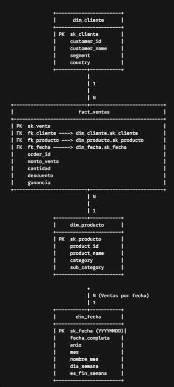
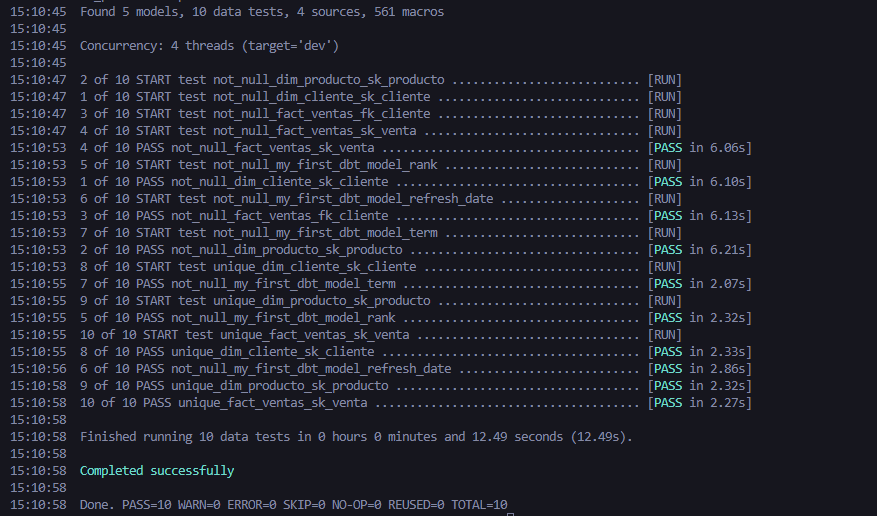
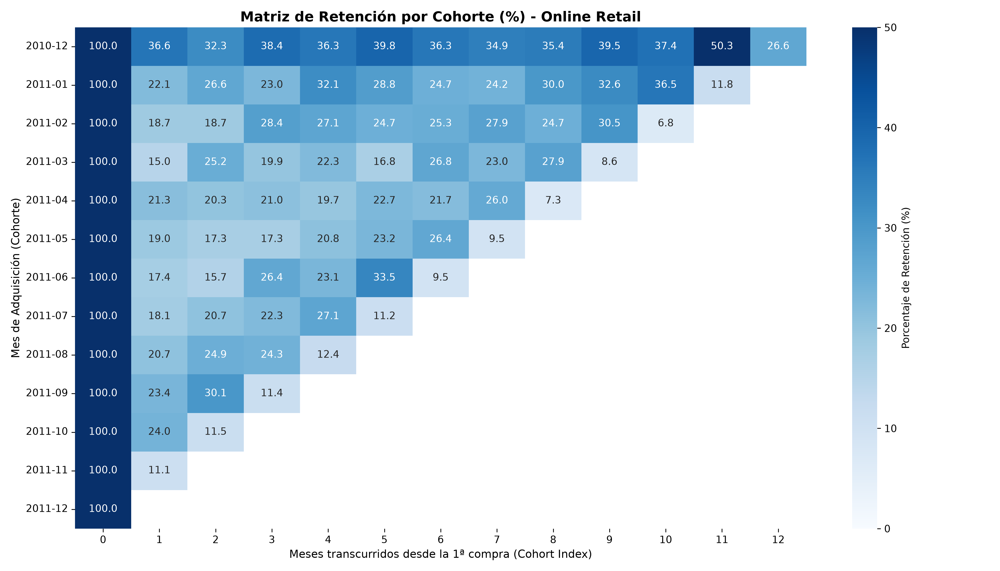

# Retail Analytics Pipeline: BigQuery + dbt + Python

[](https://www.getdbt.com/)
[](https://cloud.google.com/bigquery)
[](https://www.python.org/)

Pipeline ELT end-to-end para análisis transaccional de comercio electrónico, modelado dimensional en BigQuery con dbt, y evaluación de cohortes y Customer Lifetime Value (LTV) en Python.

---

## Contexto y Problema

Las empresas de comercio electrónico suelen almacenar grandes volúmenes de datos transaccionales sin estructurar. La falta de un modelo dimensional optimizado dificulta responder preguntas clave de negocio como:
* ¿Cuál es la tasa de retención real de los clientes mes a mes?
* ¿Cuál es el valor acumulado del cliente (LTV) según su cohorte de adquisición?
* ¿Cómo consolidar transacciones crudas en esquemas de analítica escalables y libres de duplicados?

**Solución:** Este proyecto implementa una arquitectura ELT que transforma datos transaccionales de *Online Retail*, los modela mediante un **Esquema en Estrella (Star Schema)** en **Google BigQuery** utilizando **dbt**, y consume los marts limpios desde **Python** para realizar análisis avanzado de comportamiento y valor de vida del cliente.

---

## Arquitectura de Datos

```text
[ Dataset CSV / Excel ] 
         │
         ▼
[ Google BigQuery ] ─── (Raw Layer)
         │
         ▼
[ dbt Core / Cloud ] ─── Staging (Limpieza) ──► Intermediate (Lógica) ──► Marts (Star Schema)
         │
         ▼
[ Python Data Analytics ] ──► Matriz de Retención + Análisis de Cohortes & LTV
```

---

## Tecnologías Utilizadas

* **Google BigQuery:** Data Warehouse empresarial para almacenamiento y procesamiento masivo.
* **dbt (data build tool):** Transformación de datos, pruebas de calidad (tests) y documentación de linaje.
* **Python (Pandas, Seaborn, Matplotlib):** Análisis exploratorio de datos, construcción de cohortes y visualización.
* **SQL (Standard SQL):** Consultas analíticas y lógica de transformación.

---

## Galería de Evidencias

### 1. Modelo Dimensional (Star Schema)
> Modelo final estructurado en BigQuery con tablas de hechos y dimensiones (`fact_sales`, `dim_customers`, `dim_products`).


### 2. Ejecución de Consultas y Modelado en BigQuery
> Validación de datos transformados y tests de calidad ejecutados en BigQuery / dbt.


### 3. Matriz de Retención por Cohorte (Heatmap)
> Visualización del comportamiento de retención mensualizado de clientes.


---

## Cómo Ejecutar el Proyecto

### Requisitos Previos
* Python 3.10 o superior.
* Cuenta activa en Google Cloud Platform con un dataset creado en BigQuery.
* dbt-core con conector `dbt-bigquery` instalado.

### Paso 1: Clonar el Repositorio
```bash
git clone [https://github.com/marh08192003/retail-analytics-pipeline.git](https://github.com/marh08192003/retail-analytics-pipeline.git)
cd retail-analytics-pipeline
```

### Paso 2: Configurar y Ejecutar dbt
1. Configura tus credenciales en `~/.dbt/profiles.yml` apuntando a tu proyecto de BigQuery.
2. Navega al directorio del proyecto dbt y ejecuta las transformaciones:
```bash
cd dbt_project
dbt deps
dbt run
dbt test
```

### Paso 3: Ejecutar el Análisis en Python
1. Instala las dependencias necesarias:
```bash
pip install pandas matplotlib seaborn openpyxl
```
2. Ejecuta el script de cohortes o abre el Notebook:
```bash
cd ../python_analytics
python analisis_cohortes.py
```

---

## Hallazgos Principales

* **Caída en Mes 1:** Entre el 75% y el 82% de los clientes no vuelve a realizar una compra en el mes inmediatamente posterior a su primera transacción, señalando una oportunidad estratégica para campañas de re-engagement temprano.
* **Cohorte con Mayor Valor:** La cohorte de **2010-12** demostró la mayor retención acumulada y el mayor LTV promedio por cliente ($5,087.02).